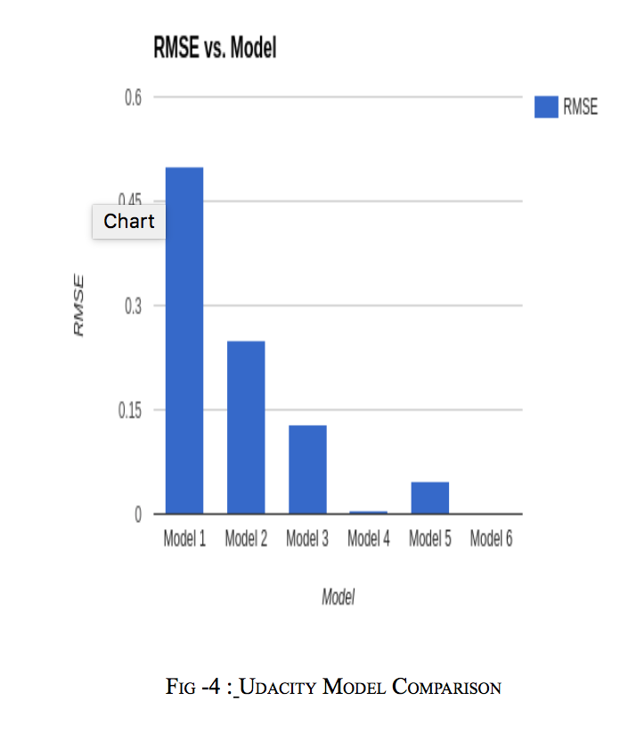
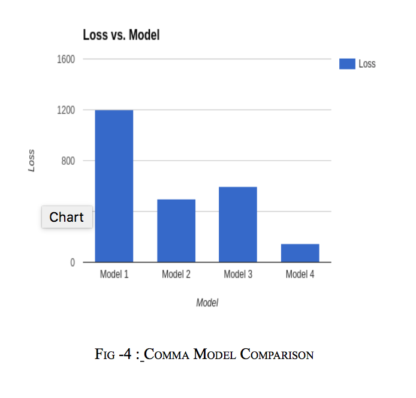
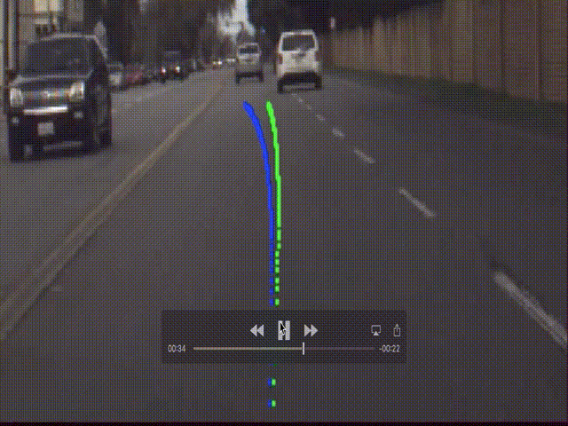
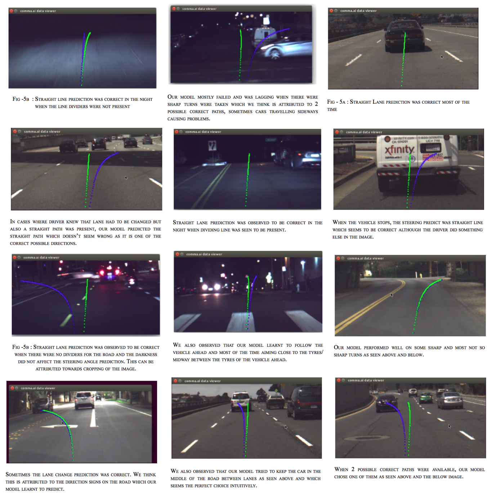

# Deep Drive
Code and Documentation for Self Driving Car steering angle prediction

For complete details along with our observation please visit [Deep Drive](https://docs.google.com/document/d/1q-JNPBcWBsqSSFshS4rlkUGLJSrG-Yifoly9DRGu9O4/edit?usp=sharing)

## Goal
We were motivated to design and implement solution for steering prediction for self driving cars. Primary goal of the project was to implement CNN based solution which can predict most accurate steering angle against given input image sets. 
We designed and tested two different models, one model which give best result for Udacity Challenge2(lets it call as module 1) and the other model for comma ai virtualization(call it as code module 2). 

In the first part model's success was measured using the root mean square (RMS) error of the predicted steering versus the actual human steering provided in input dataset. 

In the second part aims to make the predicted green path to be equal to the actual blue path in visualization.

[Udacity Challenge #2](https://medium.com/@maccallister.h/challenge-2-submission-guidelines-284ce6641c41#.p7d52u3o6)

[Comma.ai Research](https://github.com/commaai/research)

## Steps for Running Deep Drive Code 
1. Code Execution Step for Module 1 (Udacity)

1. Download Dataset from below Link :

[Udacity Self Driving Challenge 2 Dataset](https://github.com/udacity/self-driving-car/tree/master/datasets/CH2)

Note : We only used Ch2_002.tar.gz.torrent for our project

2. Run the rwightman’s reader to extract files from ROS bag files. After Extraction dataset folder struction would have following structure :
```bash
+-- dataset
|   +-- camera.csv
|   +-- steering.csv
|   +-- center
|   |   ...
|   +-- left
|   |   ...
|   +-- right
|   |   ...
```
Note : You can extract images from Ros bag files in both format JPG and PNG but we used only jpg files. Also we did entire training and testing of model only using images from central camera. We did try out with left and right camera images but we got the best results from center camera images so eventually we used only center camera images.

[For the details instruction link visit : rwightman’s reader](https://github.com/rwightman/udacity-driving-reader)


3.  Training the Model : 
In order to train the Model you will need below files :
```
main.py  model.py  data_generator.py
```
Run below command on CPU or GPU to start training the model :
```
python main.py --dataset dataset/ --nb-epoch 50 --resized-image-height 128 --resized-image-width 128
```
After succesfully execution of the main.py RMSE value will be printed on the screen and steering angle per frame id will be generated in predicted_angles.csv.

1. Code Execution Step for Module 2 (comma.ai)

1. Obtain dataset following the link : [Comma.ai Research](https://github.com/commaai/research)

1) Start training data server in the first terminal session
```bash
./server.py --batch 200 --port 5557
```  

2) Start validation data server in a second terminal session
```bash
./server.py --batch 200 --validation --port 5556
```

4) Train steering model in a third terminal
```bash
./train_steering_model.py --port 5557 --val_port 5556
```

4) Visualize results
```bash
./view_steering_model.py ./outputs/steering_model/steering_angle.json
```

Note : We have only modified train_steering_model.py as per our requirement and model.

# Acknowledgements 
We want to acknowledge dolaameng, rwightman and comma.ai. 
- Rwightman' Reader (https://github.com/rwightman/udacity-driving-reader) for extraction the ROS .bag files.
- Dolaameng (https://github.com/dolaameng/udacity-SDC-baseline) for serving as starting point for us.
- Comma.ai's (https://github.com/commaai/research) for proving us framework to visualize our model.

# Hardware Used 
- RAM - 32 GB
- GPU - NVIDIA GEFORCE GTX 1080
- Operating System - Linux Ubuntu 14.04
- Hard disk size - 2 TB

# Software Used 
- Python
- Keras
- Tensor Flow on the backend
- anaconda
- cv2
- CUDA

# Data Augmentation
We applied below data augementation techniques to boost our performance :
  1. Cropped the center camera images to be 280 X 640
  2. Resized the images to 128 X 128
  3. Image Flipping
  4. Image Blurring
  5. Image Contrast Adjectment
  6. Small Rotation of image without affecting the steering angles.
 
We observed that these data augmentation techniques helped with improvement of our existing result along with helping us with image overfitting problem.

# Model
We used NVIDIA’s model (https://devblogs.nvidia.com/parallelforall/deep-learning-self-driving-cars/) as our reference model and tried designing and testing various different CNN models based on it. The best result that we were able to produce for Udacity dataset was with below structure.


```
    x = Convolution2D(32, 3, 3, activation='relu', border_mode='same')(img_input)
    x = MaxPooling2D((2, 2), strides=(2, 2))(x)
    x = Dropout(0.25)(x)

    x = Convolution2D(64, 3, 3, activation='relu', border_mode='same')(x)
    x = MaxPooling2D((2, 2), strides=(2, 2))(x)
    x = Dropout(0.25)(x)

    x = Convolution2D(128, 3, 3, activation='relu', border_mode='same')(x)
    x = MaxPooling2D((2, 2), strides=(2, 2))(x)
    x = Dropout(0.25)(x)
   
    x = Convolution2D(256, 3, 3, activation='relu', border_mode='same')(x)
    x = MaxPooling2D((2, 2), strides=(2, 2))(x)
    x = Dropout(0.5)(x)

    x = Convolution2D(256, 3, 3, activation='relu', border_mode='same')(x)
    x = MaxPooling2D((2, 2), strides=(2, 2))(x)
    x = Dropout(0.5)(x)

    x = Convolution2D(512, 3, 3, activation='relu', border_mode='same')(x)
    x = MaxPooling2D((2, 2), strides=(2, 2))(x)
    x = Dropout(0.5)(x)

    x = Convolution2D(512, 3, 3, activation='relu', border_mode='same')(x)
    x = MaxPooling2D((2, 2), strides=(2, 2))(x)
    x = Dropout(0.5)(x)

    y = Flatten()(x)
    y = Dense(4096, activation='relu')(y)
    y = Dropout(.75)(y)
    y = Dense(2048, activation='relu')(y)
    y = Dropout(.75)(y)
    y = Dense(1024, activation='relu')(y)
    y = Dropout(.75)(y)
    y = Dense(512, activation='relu')(y)
    y = Dropout(.75)(y)
    y = Dense(1)(y)
```

The best result we got for comma.ai's visualization experiment was with below model.
```
  x = Convolution2D(16, 3, 3, activation='relu', border_mode='same')(img_input)
  x = MaxPooling2D((2, 2), strides=(2, 2))(x)
  x = Dropout(0.25)(x)

  x = Convolution2D(32, 3, 3, activation='relu', border_mode='same')(img_input)
  x = MaxPooling2D((2, 2), strides=(2, 2))(x)
  x = Dropout(0.25)(x)

  x = Convolution2D(64, 3, 3, activation='relu', border_mode='same')(x)
  x = Dropout(0.25)(x)

  y = Flatten()(x)
  y = Dense(4096, activation='relu')(y)
  y = Dropout(.5)(y)
  y = Dense(2048, activation='relu')(y)
  y = Dropout(.5)(y)
  y = Dense(1024, activation='relu')(y)
  y = Dropout(.5)(y)
  y = Dense(512, activation='relu')(y)
  y = Dropout(.5)(y)
  y = Dense(1)(y)
```


# Results
You can see the final RMS results for Udacity Challenge:



You can see the results for comma.ai experiment:





Note - Blue line indicates the actual steering angle recorded. Green line
indicates the predicted steering angle.

Various observations during testing in comma.ai experiment:



Youtube Video that shows the visualization result of model using comma.ai's research - [Deep_Drive Visualization](https://www.youtube.com/watch?v=n8aUxEpOkFw&t=3s)


# Conclusion
In this project we were able to successfully predict the steering angles on two different datasets using convolutional neural networks and were able to understand the inner details of convolutional neural networks along with the way they can be tuned. We also were able to apply techniques like data augmentation for better performance and also visualize the results on images taken from real world.

We had great fun along with learning ton's of new knowledge during the course of this project. We believe that this repository for other people working on self driving car and might help as starting point to implement other ideas to improve the performance of our model. 

